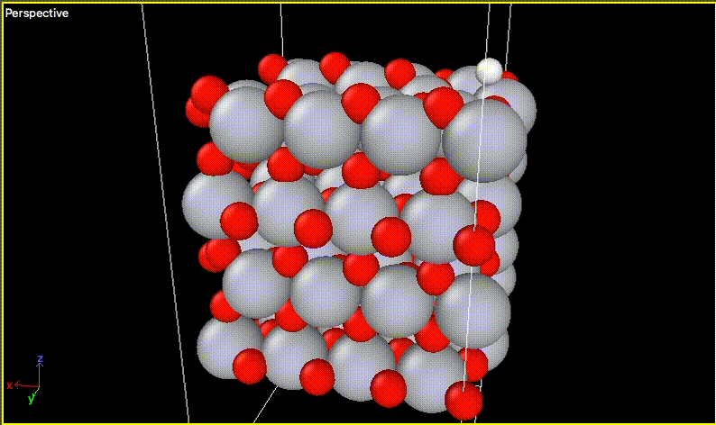
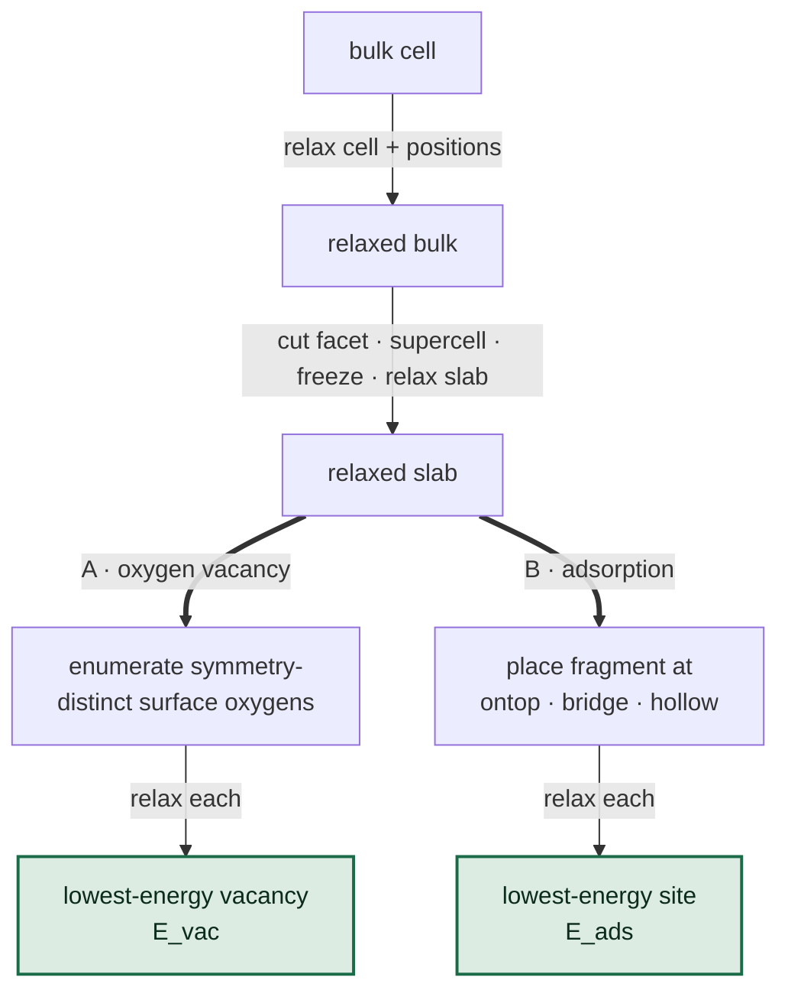

# OxideFlow

Catalytic descriptors for oxide surfaces, computed with machine-learned interatomic potentials instead of DFT.

It mirrors a standard DFT surface study step for step — relax the bulk, cut and relax a slab, create an oxygen vacancy, place an adsorbate — but runs an MLIP at every stage instead. A bulk cell becomes an adsorption energy in minutes.

The point is speed with control: any of 22 MLIPs runs over the same chain, and the settings that decide whether a model tracks DFT — facet, termination, slab thickness, supercell, vacuum, frozen fraction, adsorbate — are all exposed as flags. Two descriptors today, **A. oxygen vacancy formation energy** and **B. adsorption energy**; dissociation and hydrogen abstraction energies are next.



*H adsorption on TiO₂(110) — MACE-mh1-omat, 92 steps in 292.7 s on a 192-atom slab*

---

## What it does



Both branches are **screenings**: every symmetry-distinct site is relaxed and the lowest-energy one is carried forward. By default the adsorbate is placed on the relaxed *vacancy* slab, so the two run in sequence rather than independently. Site enumeration is exhaustive, not hand-picked — symmetry reduction keeps the list small (rutile TiO₂(110) has ~40 exposed surface atoms but only 2 distinct surface oxygens).

To measure how far a model drifts, one model acts as the **reference** and produces the chain once; each **candidate** then reruns it under one or both protocols:

| protocol | each stage is built from | measures |
|---|---|---|
| `full_pipeline` (default) | the candidate's **own** relaxed previous stage | realistic accumulated error |
| `seeded` | the **reference's** relaxed previous stage | intrinsic per-stage error |

---

## Install

```bash
pip install -e ".[dev]"
pytest                      # 53 tests, no model needed — they never load a network
```

Runtime dependencies are only `ase`, `pymatgen` and `numpy`. **The models themselves are not dependencies** — see below.

---

## Quick start

```bash
# 1. Check a material builds cleanly — seconds, no MLIP involved
python scripts/core/validate_materials.py mp-2657

# 2. Run one stage (the fast iteration loop)
python scripts/core/run_stage.py bulk --model MACE-mh1-omat

# 3. Full benchmark, one candidate against the reference
python -m oxide_workflow.pipeline --material mp-2657 --adsorbate H2O

# 4. Read the results
python scripts/core/report.py runs/latest
```

`scripts/core/launch.py` gives the same thing through menus, and prints the equivalent one-line command before it starts.

---

## Repository structure

```
oxide_workflow/       the library — 11 modules, no model imports anywhere
  config.py           every chemistry and relaxation knob (start reading here)
  structures.py       material identifier -> bulk cell, resolved offline
  stages.py           geometry only: cut slabs, enumerate vacancies, place adsorbates
  backends.py         the one interface every model sits behind
  worker_relax.py     runs inside a model's own conda env — imports no pymatgen
  energetics.py       E_ads, E_vac, gas references
  diverge.py          reference vs candidate comparison
  checks.py           post-relaxation quality flags
  records.py          the on-disk output tree and analysis tables
  pipeline.py         orchestration and the CLI

scripts/
  core/               stable entry points: fetch, validate, run a stage, report, sync
  studies/            one investigation per folder, .py and its .slurm together
    ovfe/             vacancy-formation-energy convergence sweeps
    mo2/              the rutile MO2 family sweep and its regression checks
    molecular/        per-adsorbate literature comparisons
  slurm/              SLURM infrastructure: _env.sh plus the generic jobs

data/structures/      25 materials as CIF + provenance JSON, committed so runs work offline
docs/                 user guide and demo trajectories
tests/                53 tests over the pure logic
```

---

## What you need to supply

Two things are deliberately **not** in this repository.

### 1. Model checkpoints → `models/`

Gitignored: 56 MB to 2+ GB each, and several are licence-gated. Create `models/` and place the checkpoints for whichever models you plan to run:

| file | model | where it comes from |
|---|---|---|
| `mace-mh-1.model` | MACE (6 heads) | public download |
| `orb-v2-20241011.ckpt` | Orb-v2 | public S3 download |
| `uma-s-1p2.pt` | UMA (7 tasks) | HuggingFace, gated — accept the FAIR Chemistry License |
| `uma-m-1p1.pt` | UMA-M | HuggingFace, gated |
| `esen_30m_oam.pt` | eSEN-30M-OAM | HuggingFace, gated |
| `sevennet-omni.pth` | SevenNet-Omni (4 modalities) | public download |

CHGNet needs no file — its weights ship inside the pip package.

Override the location with `OXW_MODEL_DIR` if you keep them elsewhere.

### 2. A conda environment per model family

The models have conflicting dependencies, which is the whole reason for the subprocess boundary. Create only the ones you need:

```bash
conda create -n mace-clean python=3.11 && conda activate mace-clean && pip install mace-torch ase
conda create -n fairchem   python=3.11 && conda activate fairchem   && pip install fairchem-core ase
conda create -n orb        python=3.11 && conda activate orb        && pip install orb-models ase
conda create -n chgnet     python=3.11 && conda activate chgnet     && pip install chgnet ase
conda create -n sevenn     python=3.11 && conda activate sevenn     && pip install sevenn ase
conda create -n esen       python=3.11 && conda activate esen       && pip install fairchem-core==1.10.0 ase
```

`esen` is pinned to fairchem-core 1.10.0 on purpose — its checkpoint is in a legacy format the 2.x loader dropped, so it cannot share the `fairchem` environment.

Point `OXW_CONDA_BASE` at your conda root if it is not `/opt/anaconda3`.

### 3. Optional: `MP_API_KEY`

Only needed to fetch *new* materials from Materials Project. The 25 already committed resolve offline, so the pipeline itself never needs the key or a network connection.

```bash
MP_API_KEY=... python scripts/core/fetch_structure.py mp-2657
```

---

## What is gitignored, and why

| path | why |
|---|---|
| `models/` | checkpoints are large and several are licence-gated — you stage your own |
| `runs/` | all computed output; regenerable, and a single sweep is gigabytes |
| `*.traj`, `*.log` | trajectory and log files written during relaxation |
| `__pycache__/`, `*.egg-info/`, `.pytest_cache/` | build and cache artifacts |

Everything needed to *reproduce* a run is committed — structures, configuration, scripts and job files. Only the outputs and the weights are excluded.

---

## Output

```
runs/<run>/
  summary.json          headline results, site picks, timing, provenance
  divergence.jsonl      one row per candidate × stage × protocol
  candidates.jsonl      per-site energies — the ranking-fidelity raw data
  <model>/
    bulk/               POSCAR, CONTCAR, trajectory.xyz, OUTCAR
    <protocol>/
      slab/  vacancy/  adsorbate/
        rankings.csv    every site, ordered by energy
        site<N>_<class>/
```

The tree is VESTA-friendly, and `OUTCAR` is a lightweight per-step energy log in a VASP-ish shape so existing tooling can read it.

---

## Running on a cluster

Job scripts target UBC Sockeye (SLURM) and all source one shared environment contract, `scripts/slurm/_env.sh`:

```bash
cd /scratch/<your-scratch>          # SLURM refuses submissions from /arc/project
sbatch /path/to/repo/scripts/slurm/sockeye_run_stage.slurm bulk --model MACE-mh1-omat
```

Compute nodes have no outbound network and a read-only `$HOME`, so `_env.sh` sets the offline flags and redirects every library cache to scratch. The device is read from what the scheduler actually granted rather than hardcoded. Adapting to another cluster means editing that one file.

See `CLAUDE.md` for the full cluster notes and design rationale.
